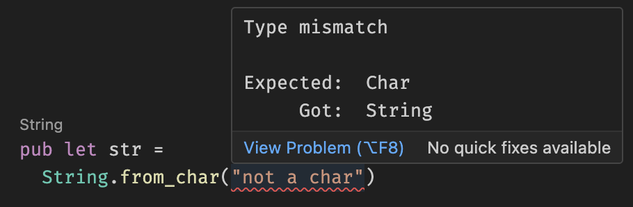
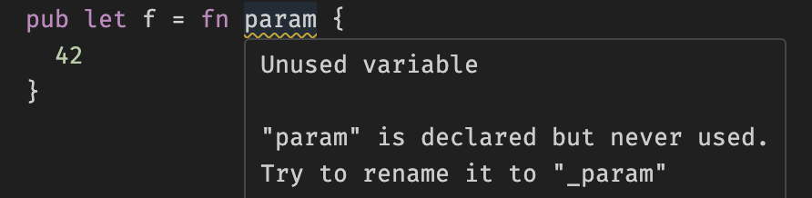
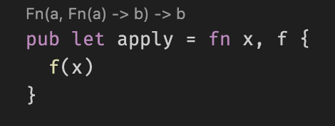
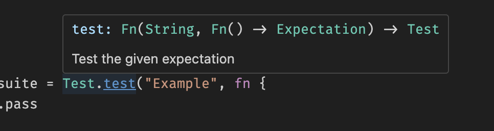
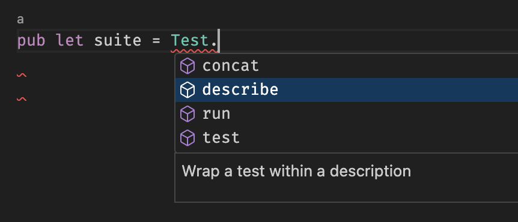
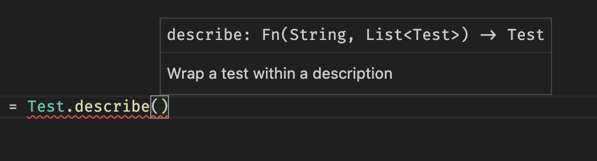

# Kestrel lang vscode

Vscode extension for [Kestrel lang](https://github.com/ascandone/kestrel-lang)

### Functionalities

#### Error diagnostics

#### Warning diagnostics

#### Code lens showing values types

#### Information on mouse hover

#### Autocomplete

#### Function paramter hints

#### Go to definition

#### Variables rename

#### Find usages of values

#### Format on save
